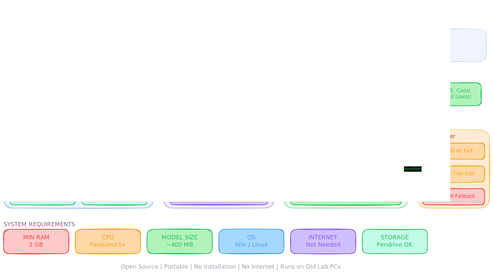
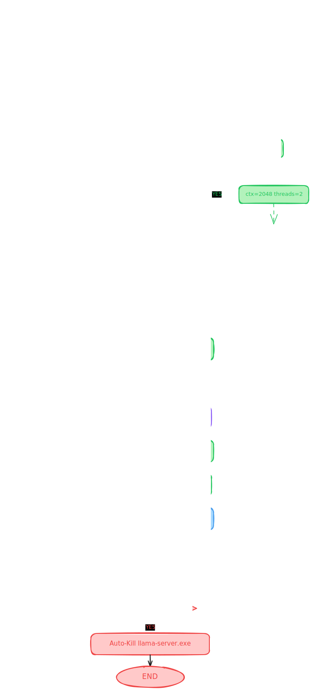

# Codai Pro

Offline AI coding assistant that runs locally on Windows with a lightweight Python controller, a local `llama-server` engine, and a browser UI.

Developer reference:

- detailed project documentation: [Documentation.md](Documentation.md)
- contributor onboarding guide: [contributor-project-info.md](docs/contributor-project-info.md)

## Visual Overview





## What It Does

- Runs fully local. No cloud API is required for normal use.
- Starts a local reverse proxy and a local inference engine.
- Serves the chat UI in the browser.
- Watches engine health and restarts the engine if it crashes.
- Works with a simple Windows launcher and cleanup script.

## Quick Start

```text
1. Keep the project folder on a normal writable path such as D:\Codai
2. Double-click run.bat
3. Wait for the launcher to report [READY]
4. Your browser opens the local UI
5. Press any key in the launcher window when you want to stop Codai safely
```

Notes:

- In this repo, `config.json` sets the UI port to `8081`, so the browser opens `http://127.0.0.1:8081/`.
- If `python` is available, `run.bat` prefers the source runtime at `dev/controller.py`.
- If Python is unavailable, the launcher can fall back to `Codai.exe`.

## Runtime Layout

```text
Codai/
├── dev/
│   ├── config.py
│   ├── controller.py
│   ├── engine.py
│   ├── proxy.py
│   ├── system.py
│   └── requirements.txt
├── docs/
│   ├── contributor-project-info.md
│   ├── docs_Plan.md
│   └── prd.md
├── engine/
│   └── llama-server.exe
├── logs/
│   ├── codai.log
│   ├── crash.log
│   ├── engine.log
│   └── codai.lock
├── models/
├── ui/
│   ├── app.js
│   ├── index.html
│   ├── logs.html
│   └── styles.css
├── config.json
├── kill.bat
├── readme.md
├── run.bat
└── Codai.exe
```

## Architecture

### 1. Launcher

- `run.bat` reads `config.json`
- computes the UI and engine ports
- starts the runtime
- waits for `/health` to report `phase=ready`
- opens the browser
- sends a graceful shutdown request when the user exits

### 2. Controller

`dev/controller.py` is the orchestrator. It loads config, analyzes hardware, starts the proxy, boots the engine, tracks runtime phase, and performs full shutdown in one place.

### 3. Proxy

`dev/proxy.py` serves the UI and forwards API requests to `llama-server`.

Important local endpoints:

- `GET /health`
- `POST /v1/chat/completions`
- `POST /frontend-error`
- `POST /shutdown`
- `GET /telemetry`

### 4. Engine

`dev/engine.py` manages the `llama-server.exe` process, port checks, lock handling, health monitoring, and restart behavior.

### 5. Frontend

`ui/app.js` polls `/health`, sends chat requests through the proxy, and updates UI state based on runtime status.

## Ports

The port comes from `config.json` or `CODAI_PORT`.

- Proxy/UI: `http://127.0.0.1:<port>/`
- Health: `http://127.0.0.1:<port>/health`
- Engine: `http://127.0.0.1:<port + 1>/`

In the current checked-in config:

- UI/proxy: `8081`
- Engine: `8082`

## Configuration

You can override values in `config.json`:

```json
{
  "port": 8081,
  "model_name": "gemma-3-1b-it-Q4_K_M.gguf",
  "ctx": 2048,
  "threads": 4,
  "host": "127.0.0.1",
  "debug": false,
  "log_level": "INFO"
}
```

Environment variables supported by the app:

```text
CODAI_PORT
CODAI_CTX
CODAI_THREADS
CODAI_MODEL
CODAI_HOST
CODAI_DEBUG
CODAI_LOG_LEVEL
```

Priority order:

1. Environment variables
2. `config.json`
3. application defaults and hardware-derived tuning

## Reliability Features

- Single-instance lock through `logs/codai.lock`
- stale lock recovery
- engine health monitor
- engine auto-restart on crash
- rotating app logs in `logs/codai.log`
- crash reporting in `logs/crash.log`
- graceful shutdown through the local `/shutdown` endpoint

## Common Commands

Run from source:

```powershell
python dev/controller.py
```

Run with the Windows launcher:

```powershell
run.bat
```

Force-clean Codai-owned local processes:

```powershell
kill.bat
```

Install the only Python dependency used by the runtime:

```powershell
pip install psutil
```

## Troubleshooting

If `run.bat` fails:

- check `logs/codai.log`
- check `logs/crash.log`
- confirm `engine/llama-server.exe` exists
- confirm the configured port is free
- confirm Python is on `PATH` if you expect the source runtime to start

If the UI loads but chat fails:

- check `GET /health`
- check `logs/engine.log`
- check whether the engine port is listening

If you need to understand the codebase before editing it:

- read [contributor-project-info.md](docs/contributor-project-info.md)

## License

Open source project focused on local-first usage and approachable hardware requirements.
